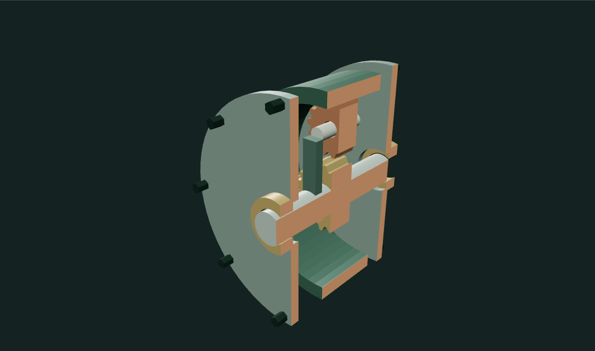
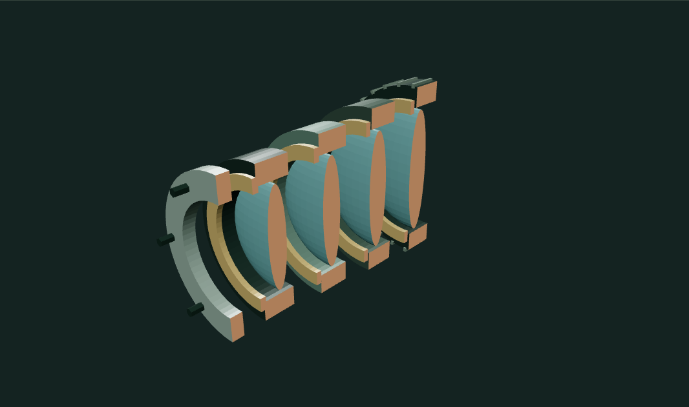

# Cutaway Explorer

Three mechanical studies: a planetary gearbox with toothed gears and bearings, a flanged pressure valve with a threaded stem and sealing disc, and a multi-element optical lens with retaining rings and grip ribs.

The cutting plane clips every triangle on the CPU. Intersections form connected section loops; nested loops become holes during Earcut triangulation through Three.js `ShapeUtils`. Caps face outward from the retained half-space and are exported as real triangles. A hollow casing therefore remains hollow rather than receiving a solid disc over its bore. Exploded offsets are included in the cutting-plane calculation.

The UI reports actual section area, total perimeter and number of intersected components. Move the plane and change axes; disable the cut for the complete object. OBJ exports precisely the visible cut geometry.

## Limits

These are illustrative, dimensionless mechanical assemblies, not functional or manufacturing-ready CAD models. Parts are not boolean-unioned; reported area adds component sections, including any overlaps. Caps require closed manifold solids. The supported presets are tested, but arbitrary OBJ/CAD imports, multi-plane intersections and physical gear/valve simulation are outside this tool's scope. Existing material boundaries become flat triangles when clipped.

## Development

`npm test`, `npm run dev`, `npm run build`. Three.js 0.180 plus the shared Graphics Workbench. Tests check exact cube area, cap orientation, hollow torus sections, out-of-range planes, finite output and cap closure across all preset parts and principal axes.

## Run and explore

[Open the portfolio demo](https://zachsm.com/experiments/cutaway-explorer). This repository runs independently and exports the same implementation used by the portfolio.

Requires Node.js 22 or later.

```sh
npm ci
npm test
npm run dev
```

`npm run build` produces a static site in `dist`. Editing, uploaded files, and exports stay in the browser. No account, server processing, or GitHub Actions is required.

## Captured examples



A capped gearbox section.



Through the lens barrel.

Exact reproduction steps are recorded in [the example manifest](examples/manifest.json).
